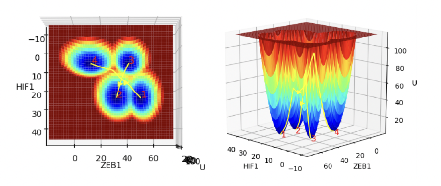
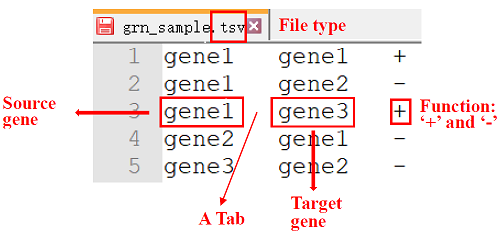
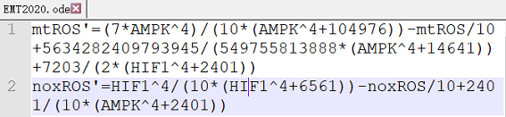

# TMELand
TMELand is a software tool for modeling and visualization of Waddington's epigenetic landscape and state transition paths based on dynamical models of gene regulatory network (GRN).



Our paper on TMELand has been submitted:  
[Lin Zhu, Xin Kang, Chunhe Li and Jie Zheng. TMELand: An end-to-end pipeline for quantification and visualization of Waddington’s epigenetic landscape based on gene regulatory network, 2022.]    
For more details, please check out the [User Manual](https://github.com/JieZheng-ShanghaiTech/TMELand/blob/main/User%20Manual.pdf).


### Installation
TMELand is developed by Python, you can install [Anaconda](https://docs.anaconda.com/anaconda/install/) and create virtual environment to install dependencies.

```
# Create a virtual environment and install dependency packages
$ conda create –n TMELand_env python=3.7
$ conda activate TMELand_env
$ pip install -r requirements.txt

# Install R and R packages
$ conda install -c conda-forge r-base=4.1.0
$ conda install -c r r-mass

# Install Ruby
1. Linux (Ubuntu): $ sudo apt-get install ruby-full
2. MAC OS: $ brew install ruby
3. Windows: https://github.com/oneclick/rubyinstaller2/releases/download/RubyInstaller-3.1.0-1/rubyinstaller-3.1.0-1-x64.exe
```


### Launch

You can launch TMELand in the terminal after finish dependency package installation.

```
$ python ./Main.py
```


### Usages

#### Input: 
The TMELand supports TSV, XPPAUT ODE, SBML, and single-cell gene expression data.

* TSV: TSV (Tab-separated values) format file stores a collection of interaction relationships of genes with a specific definition, which can reflect the gene regulatory network topology. 

  Each line of a TSV file includes two gene names and one interaction relationship between these two genes, ‘+’ represents the first gene activates the second gene, and ‘-’ represents the first gene inhibits the second gene. Each item in a line is separated by a tab. An example with instructions is given as follow:

  
  
* XPPAUT ODE: XPPAUT ODE format file consists of a set of ODE equations and correlated parameters. In our support ODE models, you can follow the following rules. (XPPAUT ODE format file parsing code refer to https://github.com/MCLand-NTU/MCLand)

  1. (Optional) Ignore lines that begin with ‘#’ or ‘@’;

  2. (Optional) Define parameters by using a line starting with ‘par’, multiple parameters are separated by a comma;

  3. (Momentary) Define differential equations by starting with ‘Var’=’ or ‘dVar/dt=’, Var refers to a variable;

  4. (Optional) Define constant by starting with ‘const’;

  5. (Optional) Define initial values by starting with ‘init’;
     This is an example:

	
  
* SBML: [SBML](https://en.wikipedia.org/wiki/SBML) is an abbreviation of Systems Biology Markup Language. It is a representation format, based on XML, for communicating and storing computational models of biological processes. Generally, we can use an SBML file that describes transcriptional regulations from the BioModels Database. [BioModels](https://pubmed.ncbi.nlm.nih.gov/16381960/) Database contains rich mathematical models of biological systems with a specific format. For more information, please refer to https://www.ebi.ac.uk/biomodels/.
  Due to the complication of SBML, we don’t show an example here. You can refer to the ‘ODE_SBML_models’ folder in TMELand code for a full example.

* Single-cell data: for single-cell data, users should provide a 'gene x cell' gene expression matrix and a pseudotime list of cells. Moreover, for better analysis, users should prepare a gene name list and a cell name list in the plain text file.
  
* TME: TME is a self-defined model using JSON format, which is used to save computed model and next reloading. We can save landscape only or landscape with paths.

#### Main functions summary:
* Model visualization

After loading your models, you can obtain the parsed and visualized results of your models.

- GRN inference and editing

For single-cell data, we incorporate a GRN inference algorithm and provide topology editing functionality to improve the reliability of the inferred GRN.

- Model simulation

For the acquired DE-based GRN model, we can simulate lots of trajectories to analyze the convergence.

* Drawing landscape

To draw a landscape, there are three steps:
1. **Form ODE equations** (only needed for topology-based models): by `DE-based GRN` button to generate ODE equations.

2. **Draw**: this step corresponding to the `Draw` button, which includes simulation and default visualization (using the first two marker genes and setting visualization range from 0 to 3).

3. **Update**: you can adjust the marker genes and range to update the landscape by `Update` button. If you need to change model-related parameters, you only need to click `Draw` button without reupdate. Furthermore, update is also worked for a TME model, you can update the landscape shape after load a TME model.

* Drawing transition paths

After drawing the landscape, you can draw state transition paths between two attractors by specifying time range, granularity, beginning and ending attractors. You can also draw paths after load a TME model, and update landscape will keep paths.
